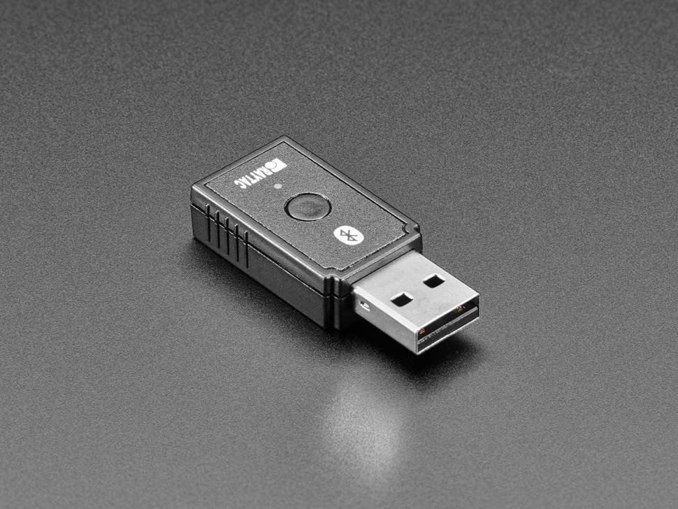
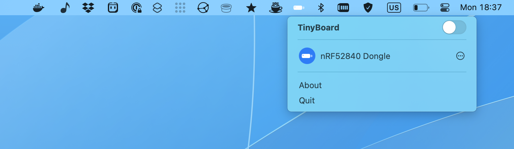
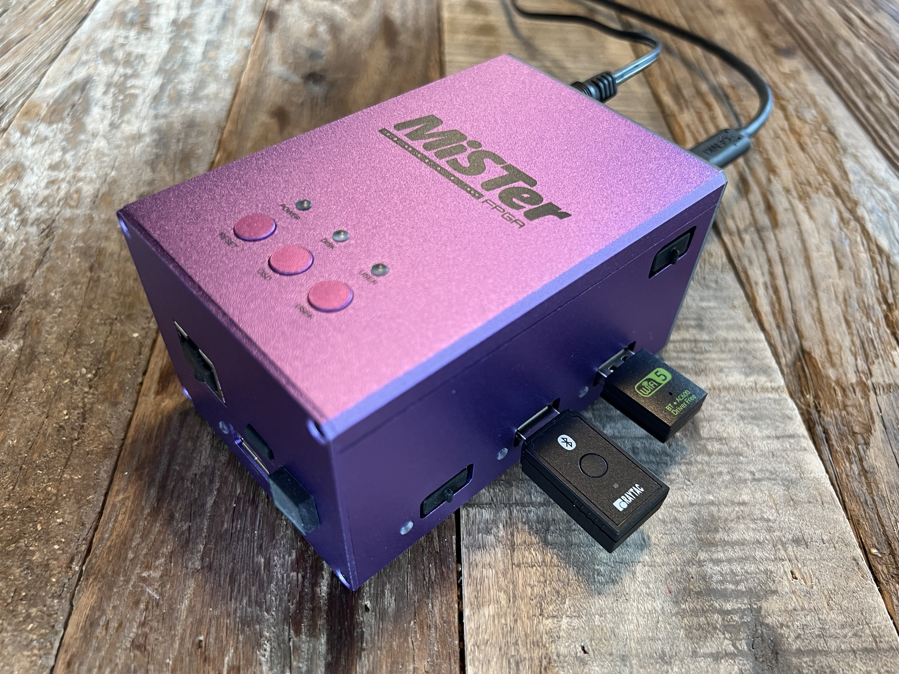

# TinyBoard

USB keyboard proxy





## Overview

TinyBoard is a keyboard proxy that lets you control another device with your Mac. The project is based on the [Raytac MDBT50Q-RX](https://www.raytac.com/product/ins.php?index_id=89) and provides custom Arduino-based firmware and a corresponding macOS app. The MDBT50Q-RX plugs into the device you wish to control, and the Mac app forwards whatever you type on your Mac keyboard using Bluetooth.



<p style="text-align: center">The TinyBoard is perfect for controlling devices like the MiSTer or Raspberry Pi on-the-go</p>

## Getting One

Right now, you'll have to buy a Raytac MDBT50Q-RX from [Adafruit](https://www.adafruit.com/product/5199), flash it, and build the macOS app yourself. It's best to buy from Adafruit as they sell versions pre-flashed with the TinyUF2 boot loader which makes it easy to flash with the Arduino IDE.

If there's enough demand for pre-flashed devices I'm open to selling some flashed ones at a small markup.

## Development

TinyBoard follows the version numbering, build and signing conventions for InSeven Limited apps. Further details can be found [here](https://github.com/inseven/build-documentation).

### Commits

Commit messages conform to [Conventional Commits](https://www.conventionalcommits.org/en/v1.0.0/) and use the following scopes to distinguish between changes in different components:

- firmware – changes the Raytac MDBT50Q-RX firmware
- macOS – changes to the macOS app

For example, a change to the macOS app might the following description:

```
feat(macOS): Support for macOS Ventura
```

## Licensing

TinyBoard is licensed under the MIT License (see [LICENSE](https://github.com/inseven/tinyboard/blob/main/LICENSE)).