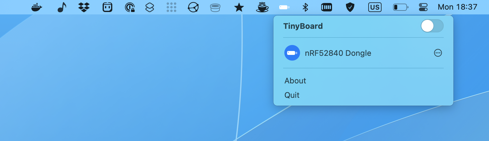

# TinyBoard

Bluetooth USB keyboard and mouse proxy.

## Contributing

We invite and welcome contributions! There's a pretty comprehensive list of [issues](https://github.com/inseven/tinyboard/issues) to get you started, and our documentation is always in need of some care and attention.

Please recognize Reconnect is a labour of love, and be respectful of others in your communications. We will not accept racism, sexism, or any form of discrimination in our community.

## License

TinyBoard is licensed under the MIT License (see [LICENSE](LICENSE)). It depends on the following separately licensed third-party libraries and components:

- [Diligence](https://github.com/inseven/diligence), MIT License
- [Glitter](https://github.com/inseven/glitter), MIT License
- [Interact](https://github.com/inseven/interact), MIT License
- [Licensable](https://github.com/inseven/licensable), MIT License
- [Sparkle](https://github.com/sparkle-project/Sparkle), Sparkle License
